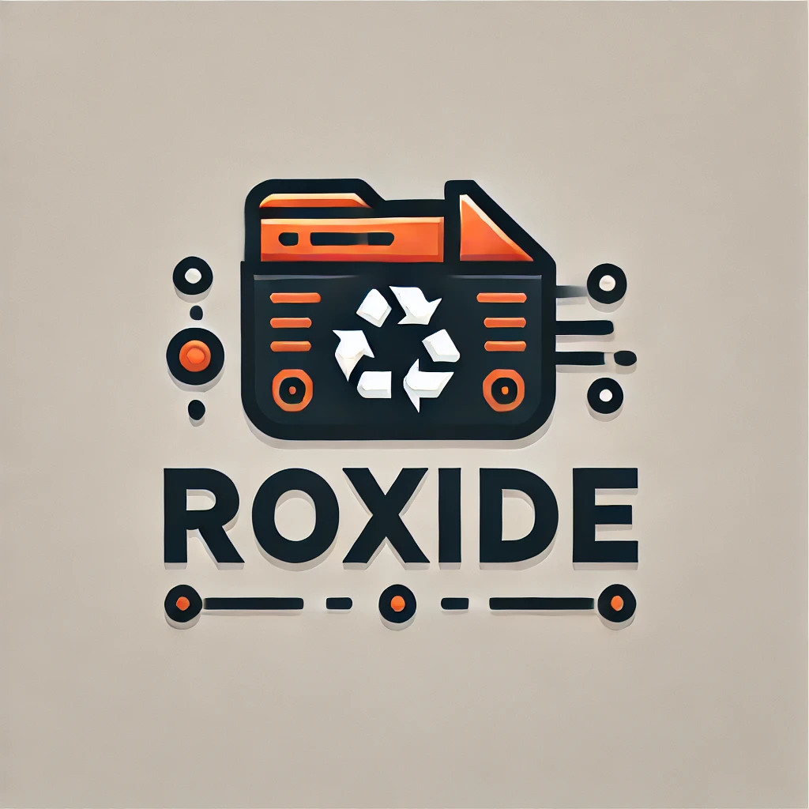

<div id="header" align="center">
  
</div>

# roxide

`roxide` is a lightweight, high-performance alternative to the traditional `rm` command, designed with an emphasis on speed and data preservation. Unlike standard rm, which permanently deletes files, roxide safely moves them to a designated "`trash`" directory. This approach enables efficient and fast file removal without risking unintended data loss.

**Note**: I am an amateur Rust programmer, so while this code might not be the most refined, it prioritizes safety and has been thoroughly tested. If you have ideas for improvement or notice any issues, contributions are very welcome! This project is open to suggestions, code reviews, and pull requests from developers of all experience levels.

## Getting started

- `roxide file.txt`: files will moved to `trash dir`. ie, $HOME/.local/share/Trash/files/
- `roxide revert` : restores perviously removed file/directory to its pervious path 
- `roxide -r | --recursive` : Remove directories and their contents recursively
- `roxide -f | --force` : Remove without moving to trash directory
- `roxide -v | --verbose` : will print the file name and its out path
- `roxide some/dir/ -p .pdf`: will remove files matching the pattern from some/dir
- `roxide some/dir/ -rp .pdf`: will recursively remove files matching the pattern from some/dir
- `roxide some/dir/ -rp .pdf -l`: will list files, like dry run

> `revert` cant bring back files removed using patterns but you can still access it from Trash dir

## Installation

### Build

```bash
git clone https://github.com/abhi-xyz/roxide.git --depth=1 
cd roxide
cargo build --release
cp target/release/roxide /usr/local/bin/
```

### cargo

```bash
cargo install roxide
```

### Nixos

Add `roxide` as a flake input: In your flake.nix file, add the roxide input pointing to its GitHub repository.
```nix
{
  inputs = {
    nixpkgs.url = "github:NixOS/nixpkgs";
    roxide = {
      url = "github:abhi-xyz/roxide";
      inputs.nixpkgs.follows = "nixpkgs"; # Follows the nixpkgs input
    };
  };

  outputs = { self, roxide, nixpkgs, ... }@inputs:
  {
    # Your NixOS configuration or other settings
  };
}
```

Include roxide in NixOS configuration: In the outputs section, set up nixosConfigurations and add roxide as a module to enable it within your system configuration.
```nix
{
  outputs = { self, roxide, nixpkgs, ... }@inputs:
  {
    nixosConfigurations."my-nixos-host" = nixpkgs.lib.nixosSystem {
      system = "x86_64-linux";
      specialArgs = { inherit inputs; };
      modules = [
        ./hosts/configuration.nix # Main NixOS configuration file
        roxide.nixosModules.roxide      # Enable the "roxide" module from the flake
      ];
    };
  };
}
```
Activate "roxide" in configuration.nix: Within configuration.nix, enable the "roxide" program:
```nix
{
  # Other configurations...
  
  program.roxide.enable = true; # note: its program not programs
}
```
Apply Configuration: After updating your configuration, apply it with:
```bash
sudo nixos-rebuild switch --flake .
```

## known bugs
- won't warn about git directory
- can't use sudo 
- ~~golb pattern isn't working~~
- ~~pattern -flag interfering with other flags~~
- ~~cant remove a directory which is inside a directory~~

## Planned Features
- ~~roxide revert:  Restores files from the trash directory to their original location.~~
- roxide --gc <TIME_PERIOD>:  Performs garbage collection on trashed files, automatically clearing files older than a specified period.
- ~~roxide -f:  Forces deletion without moving files to the trash directory.~~
- roxide -s:  Shreds files for secure deletion.
